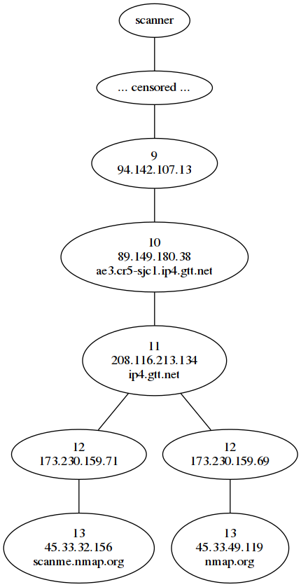

# Pathfinder - nmap traceroute graphing
Generates a graph of the traceroute information in nmap XML files using graphviz. The tool was specifically written to process very large nmap reports (> 2 GB).

The traceroute information can give insight into the network topology, e.g.:
* Identify exposed systems not protected by the firewall
* Identify separate network segments

The following graph shows an example of the traceroute for the targets scanme.nmap.org and nmap.org (sudo nmap -sn --traceroute -oA nmap scanme.nmap.org nmap.org):



# Why not just use Zenmap
* Handling of huge files (pathfinder parses nmap report files line by line and can therefore process huge files)
* (Manual) Customization of final graph (graphviz dot syntax)

# Requirements:
* pygraphviz
* untangle
* lxml

# Usage
```
             _   _      __ _           _                 
 _ __   __ _| |_| |__  / _(_)_ __   __| | ___ _ __   
| '_ \ / _` | __| '_ \| |_| | '_ \ / _` |/ _ \ '__| 
| |_) | (_| | |_| | | |  _| | | | | (_| |  __/ |     
| .__/ \__,_|\__|_| |_|_| |_|_| |_|\__,_|\___|_|    
|_|                                                      
      ------------------------------------->
                               _                                      _                                _     _             
 _ __  _ __ ___   __ _ _ __   | |_ _ __ __ _  ___ ___ _ __ ___  _   _| |_ ___     __ _ _ __ __ _ _ __ | |__ (_)_ __   __ _ 
| '_ \| '_ ` _ \ / _` | '_ \  | __| '__/ _` |/ __/ _ \ '__/ _ \| | | | __/ _ \   / _` | '__/ _` | '_ \| '_ \| | '_ \ / _` |
| | | | | | | | | (_| | |_) | | |_| | | (_| | (_|  __/ | | (_) | |_| | ||  __/  | (_| | | | (_| | |_) | | | | | | | | (_| |
|_| |_|_| |_| |_|\__,_| .__/   \__|_|  \__,_|\___\___|_|  \___/ \__,_|\__\___|   \__, |_|  \__,_| .__/|_| |_|_|_| |_|\__, |
                      |_|                                                        |___/          |_|                  |___/ 

    Info: Generates a graph via graphviz of the traceroute information in nmap XML files (nmap --traceroute [...]).

    pathfinder.py -i <nmap_xml_input_file> -o <outputfile> [-s <True|False>] [-d <True|False>]


    --help		This help text
    --ifile		The Nmap XML file to parse for traceroute information
    --ofile		Filename for output files: Graphviz dot and png file
    --skipDestHost	(Optional) For better visibility in huge scans the destination host can be excluded 
                        from the graph resulting in only the route information.
    --destIpToNetwork	(Optional) For better visibility in huge scans the destination IP can be transformed
                        into a class C network (e.g. 192.168.1.2 -> 192.168.1.0/24).
```


